<h3>Conpte rendu 2</h3>
<h5>Partie 1 :</h5>

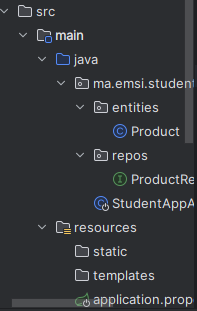

<h6>Table produit </h6>
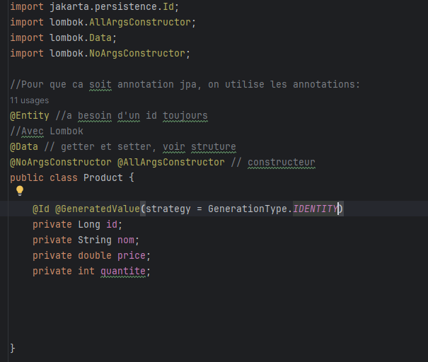

<h6>Interface </h6>
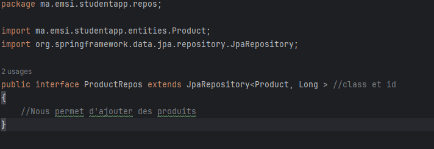

<h6>Manipulation : CRUD </h6>
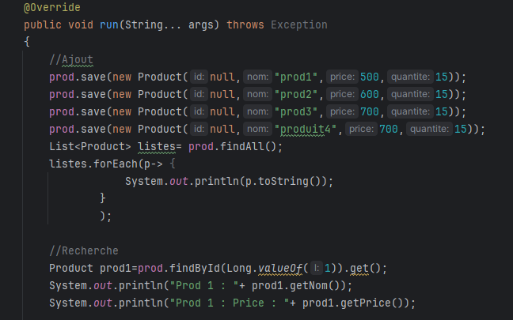

<h6>Execution </h6>
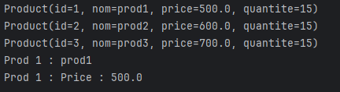

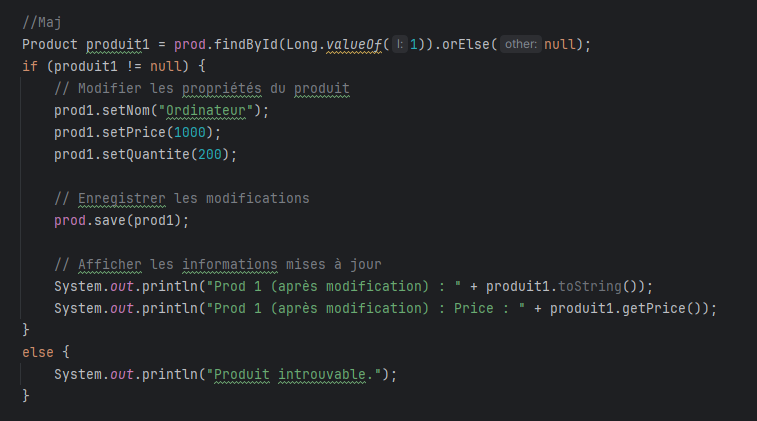
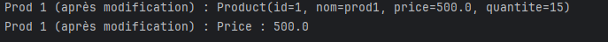

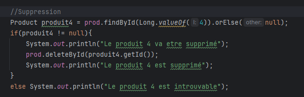

<h6>H2 Database </h6>
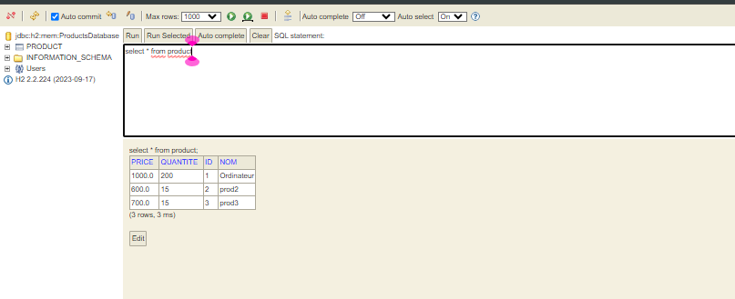

<h5>Partie 2 :</h5>
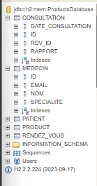

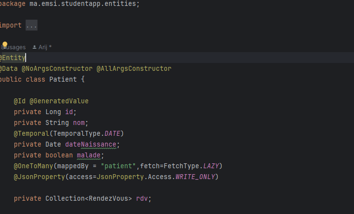
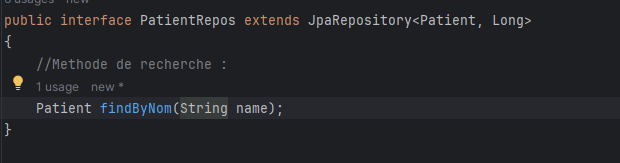

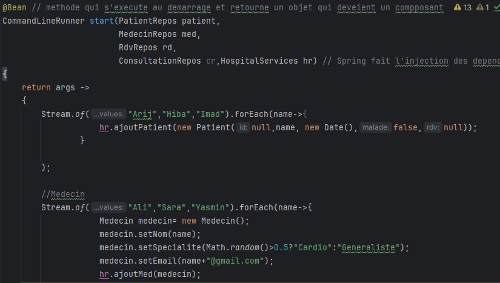
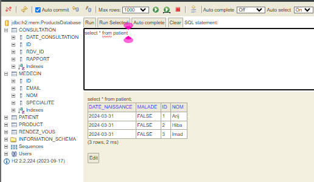
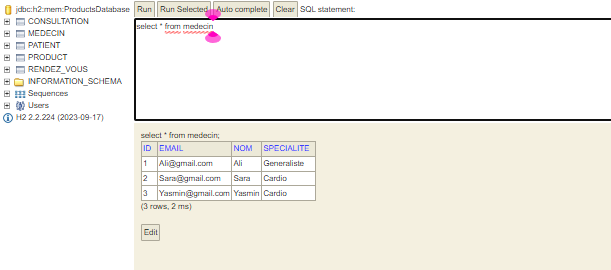

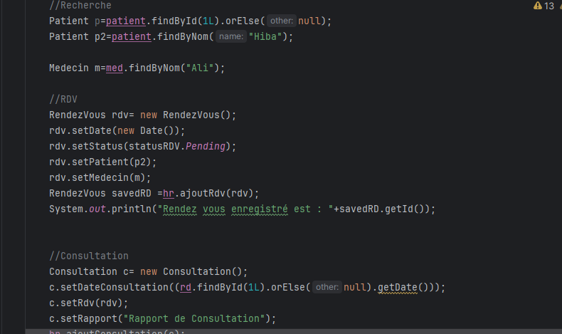
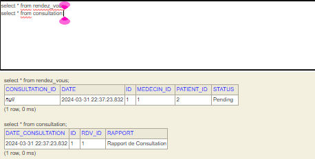